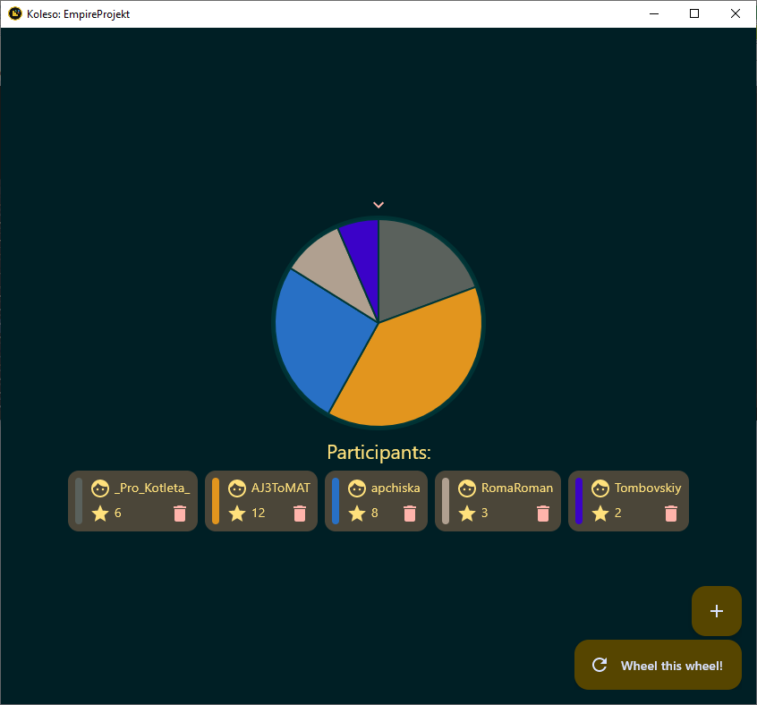

# Koleso

Koleso is a simple LuckyWheel implementation which can be not so fair, so use it with caution if you will!

# See EmpireProjekt

- [Site](https://empireprojekt.ru)
- [TG](https://t.me/empiresmp)
- [Discord](https://discord.com/invite/Gwukdr8)

### Some stack

| Non-default Libraries used |                                             Author/Organization |   
|:---------------------------|----------------------------------------------------------------:|
| Compose MPP                | [JetBrains](https://github.com/JetBrains/compose-multiplatform) |
| Decompose                  |                  [Arkadii Ivanov](https://github.com/arkivanov) |
| Gradle boilerplate         |   [gradle-plugin](https://github.com/makeevrserg/gradle-plugin) |

### See other tons of my projects

- [Organization](https://github.com/Astra-Interactive)
- [My Profile](https://github.com/makeevrserg)